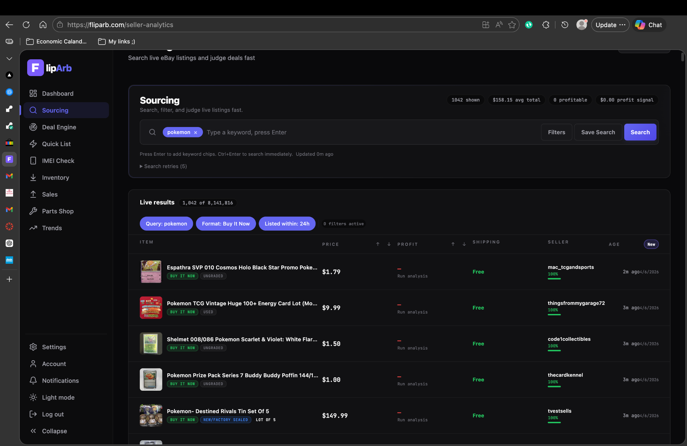
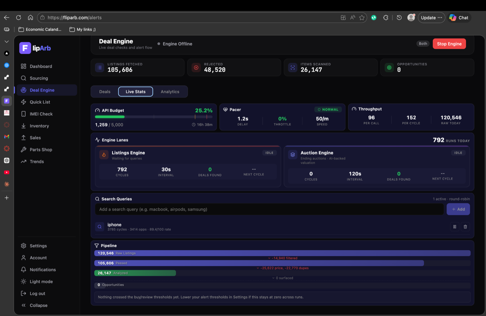

# FlipArb

**Marketplace intelligence and adaptive deal discovery for online resellers**

FlipArb is a data and automation project I built from my experience buying, repairing, and reselling phones and electronics. It was developed through the **University of Delaware VentureOn entrepreneurship program** and combines marketplace data, pricing logic, Bayesian learning, API integrations, AI assisted analysis, and real world resale validation.

During development and testing, FlipArb scanned **more than 200,000 marketplace listings**. One captured Deal Engine session recorded **120,546 raw listings**, **105,606 listings that passed initial filtering**, and **26,147 listings that reached analysis**.

Deals identified by the system were used in real purchasing decisions. Devices surfaced by FlipArb were purchased, shipped to me, and later resold.

> **Project status:** The hosted deployment is currently paused to avoid recurring hosting and API costs. The original production repository remains private. This public repository is a portfolio showcase of the data pipeline, learning system, architecture, analysis workflow, and product results.

## Business problem

Online resale sourcing is a speed and information problem. A listing can look cheap while still being a bad purchase because of repair costs, carrier lock status, weak comparable sales, poor seller quality, or low market liquidity.

FlipArb was designed to turn that manual decision process into a repeatable analytical pipeline.

## What FlipArb does

* Searches newly listed marketplace inventory
* Monitors ending auctions
* Detects common misspellings that may receive less buyer attention
* Rejects obvious accessories and low quality matches before expensive analysis
* Reuses recent analysis when a listing has already been evaluated
* Pulls comparable sales and estimates expected resale value
* Uses repair pricing to estimate parts cost
* Checks device status when lock information matters to resale value
* Uses AI assisted listing verification and image analysis
* Calculates projected profit and return on investment
* Produces confidence, risk, freshness, and liquidity signals
* Classifies opportunities as alert ready, needs review, or rejected
* Sends structured notifications when a listing meets the required gates
* Learns which search queries are most productive and reallocates scanning budget over time

## Machine learning and adaptive search

FlipArb uses **Thompson Sampling**, a Bayesian multi armed bandit method, to learn which search queries are most effective.

Each query maintains a Beta distribution that represents its observed performance. Queries that surface stronger opportunities receive better rewards and are more likely to receive additional scanning budget in future cycles. Poorly performing queries gradually receive less budget.

The learning system includes:

* Bayesian Thompson Sampling for query selection
* Quality weighted rewards based on opportunity confidence and classification
* Dynamic scan budget allocation
* Daily model decay so old winners do not dominate forever
* Time of day and day of week learning for each query
* Auction outcome feedback that updates query performance

This is an online learning and decision optimization system. It is separate from the OpenAI powered listing analysis described below.

## Data pipeline

```text
Marketplace listing
      ↓
Cheap viability screen
      ↓
Cache and duplicate check
      ↓
Rule based device verification
      ↓
OpenAI assisted verification
      ↓
Comparable sales analysis
      ↓
Repair and device status enrichment
      ↓
Projected profit and ROI
      ↓
Confidence and risk scoring
      ↓
Liquidity and freshness signals
      ↓
Opportunity classification
      ↓
Dashboard and notifications
      ↓
Performance feedback to learning system
```

The pipeline is intentionally staged. Cheap checks happen first so expensive API calls and AI analysis are reserved for listings that have a better chance of becoming useful opportunities.

## Integrations

* **eBay APIs** for marketplace search, item data, auction monitoring, and comparable sales workflows
* **MobileSentrix API** for replacement part pricing and repair cost estimation
* **SickW API** for phone status checks including carrier or network lock verification
* **OpenAI API** for listing verification, text analysis, image condition analysis, model extraction, and red flag detection
* **Discord webhooks** for structured opportunity alerts
* **Render** for backend and worker deployment during active development
* **Vercel** for the web deployment during active development

## Scoring and decision support

FlipArb does not rank a listing from price alone. The system combines expected resale value, projected profit, return on investment, comparable sale quality, condition risk, freshness, market liquidity, device status, and confidence.

A simplified public view of the scoring process is included in [`src/scoring_demo.py`](src/scoring_demo.py).

The original production logic remains private.

## Real world validation

FlipArb was used to support actual resale decisions rather than only simulated analysis.

* The scanner surfaced real listings
* Selected devices were purchased and shipped to me
* Devices were evaluated through the same repair and resale workflow that motivated the project
* Purchased devices were later resold
* Observed outcomes informed how I thought about sourcing quality, query performance, risk, and profitability

## Scale

A recorded Deal Engine session showed:

* **120,546 raw listings fetched**
* **105,606 listings passed initial filtering**
* **26,147 listings analyzed**
* API budget monitoring and cycle level controls

Across development and testing, the project scanned **more than 200,000 listings**.

These figures describe development and testing activity. They are not customer counts or revenue figures.

## API efficiency and platform constraints

The scanner was built around official marketplace API access and technical constraints. It used cycle budgets, caching, staged filtering, source efficiency tracking, duplicate suppression, and throttle monitoring to reduce unnecessary calls.

The public project does not claim formal legal certification by eBay. It shows the engineering controls I used to work within API quotas and platform constraints.

## Screenshots

### Sourcing dashboard



The sourcing view displayed marketplace listings with price, projected profit, shipping, seller information, and listing age.

### Deal Engine dashboard



The Deal Engine view tracked scanner throughput, filtering volume, analysis volume, and API usage.

## Public data science materials

This repository includes recruiter friendly materials that demonstrate the analytical thinking behind the product without exposing production secrets.

* [`notebooks/fliparb_analysis.ipynb`](notebooks/fliparb_analysis.ipynb) contains a portfolio analysis using synthetic sample data
* [`data/sample_listings.csv`](data/sample_listings.csv) is synthetic data created only for public demonstration
* [`src/scoring_demo.py`](src/scoring_demo.py) shows a simplified scoring workflow
* [`src/thompson_sampling_demo.py`](src/thompson_sampling_demo.py) demonstrates the Bayesian query selection concept
* [`docs/LEARNING_SYSTEM.md`](docs/LEARNING_SYSTEM.md) explains the learning design
* [`docs/ARCHITECTURE.md`](docs/ARCHITECTURE.md) explains the system architecture

## Tech stack

**Languages:** Python, JavaScript, SQL

**Analytics:** data cleaning, comparable sale analysis, pricing logic, confidence scoring, risk scoring, liquidity analysis, Bayesian learning

**APIs:** eBay, MobileSentrix, SickW, OpenAI

**Infrastructure:** asynchronous HTTP workflows, database backed opportunity records, API budget controls, Discord notifications, Render, Vercel

## What I learned

FlipArb required me to combine business analytics with software engineering and real resale operations. The most difficult problems were deciding which signals actually mattered, handling noisy marketplace data, preserving API budget, separating working devices from donor devices, preventing duplicate analysis, estimating repair cost, and turning uncertain information into a decision that could be acted on quickly.

The project gave me practical experience with data pipelines, API systems, Bayesian learning, decision rules, product analytics, and validation against real transactions.

## Repository purpose

The original FlipArb production repository remains private because it contains implementation details, operational logic, and integration configuration that are not required for portfolio review.

This public repository is designed to show recruiters and hiring managers:

* the business problem
* the analytical workflow
* the data pipeline
* the Bayesian learning component
* the API architecture
* the scale reached during testing
* the connection between model output and real world decisions

## Public portfolio page

The GitHub Pages site is stored in the [`docs`](docs) folder. After GitHub Pages is enabled for this repository, the site becomes the main public presentation of the project.
